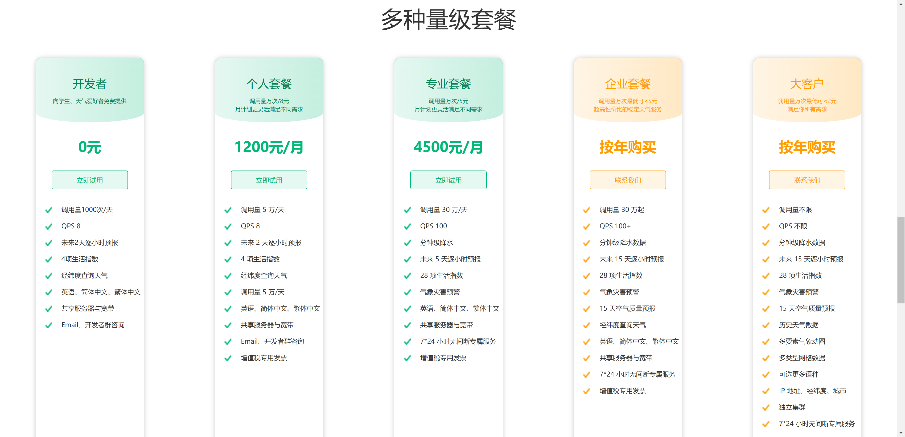

# weather-sms

# 使用 `imessage` 发送天气消息

## 彩云天气
使用最新的 `v2.6` 彩云API，[需要去申请key](http://caiyunapp.com/api/weather_intro.html)
1. 为什么选择使用彩云天气？

   手机用了蛮多年的，并且没有其他APP那么多花里胡哨的广告，开发者 `调用量1000次/天` 对于我目前的需求是足够用的。



## 如何使用
1. 修改配置文件 `conf/config.yaml`即可灵活发送你的专属定制
2. 考虑到手机屏幕显示的问题，内容会根据 `空格` 自动换行


## eg:
```text
XXX早上好呀

今日温度为: 11°C~26°
当前温度为: 15°C
体感温度为: 14.1°C
相对湿度为: 66%
舒适度指数为: 凉爽
当前天气状况: 未来24小时多云
未來兩小時: 未来两小时不会有雨。还在加班么？注意休息哦
日出: 06:20, 日落: 19:11

记得按时吃饭哦(￣^￣)ゞ

bogeia
```